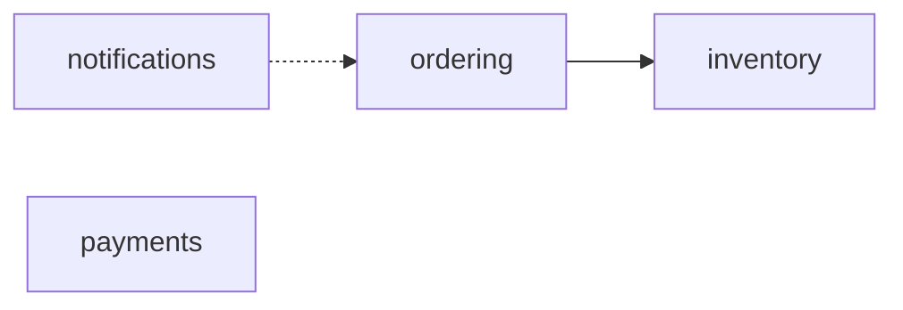

# Modulith Rules

Pre-built ArchUnit rules for enforcing module boundaries in modular monolith architectures.

Modulith Rules runs entirely at test time. It has no runtime footprint, no framework
coupling, and no impact on your production classpath.

## Project status

The first public release, `v0.2.0`, is published to Maven Central under the
`io.modulith` group id. The sources on `main` carry the next development version
(`0.2.0-SNAPSHOT`); to work against unreleased changes, build from source (see
[Installing](#installing)). The release process itself is documented in
[PUBLISHING.md](PUBLISHING.md).

## Requirements

| | Version |
|---|---|
| Java | 17 or newer (CI builds on 17 and 21) |
| ArchUnit | 1.4.2 |
| JUnit | 6.1.2 (JUnit Platform) |
| Spring Boot | 4.1.0 (optional, only for `modulith-rules-spring`) |

These are the versions the library is built and tested against. The core module uses only
long-stable ArchUnit APIs, so older ArchUnit and JUnit 5 lines are likely to work, but
they are not covered by CI, so verify before relying on them.

Spring dependencies in `modulith-rules-spring` are `provided` scope: you bring your own
Spring version, and nothing Spring-related is added to your runtime classpath.

## Installing

Add the core module in `test` scope:

```xml
<dependency>
    <groupId>io.modulith</groupId>
    <artifactId>modulith-rules-core</artifactId>
    <version>0.2.0</version>
    <scope>test</scope>
</dependency>
```

Add `modulith-rules-spring` as well if you want the Spring-specific rules:

```xml
<dependency>
    <groupId>io.modulith</groupId>
    <artifactId>modulith-rules-spring</artifactId>
    <version>0.2.0</version>
    <scope>test</scope>
</dependency>
```

To work against unreleased changes instead, build from source and depend on the
`0.2.0-SNAPSHOT` version:

```bash
git clone https://github.com/modular-monolith/modular-monolith-rules.git
cd modular-monolith-rules
mvn clean install
```

## Quick start

The fastest path is convention-based: each module's base package is derived as
`<rootPackage>.<moduleName>`.

```java
@AnalyzeClasses(packages = "com.example")
class ArchitectureTest {

    @ArchTest
    static final List<ArchRule> rules =
        ModulithRules.forPackage("com.example", "ordering", "payments", "inventory")
                     .allRules();
}
```

Note that `allRules()` is deliberately narrow. It returns exactly three rules:
allowed-dependency enforcement, internal-package protection, and cycle detection. It does
**not** include communication-contract or Spring rules; add those explicitly (see
[Applying rules](#applying-rules)).

### Declaring modules explicitly

`ModuleDefinition.builder(name)` requires a `basePackage`. Omitting it throws
`IllegalStateException: basePackage must be set for module '<name>'`, so set it on every
module you build by hand:

```java
private static final ModulithRuleSet RULE_SET = ModulithRuleSet
    .forRootPackage("com.example")
    .module(ModuleDefinition.builder("ordering")
        .basePackage("com.example.ordering")          // required
        .apiPackages(".api.")
        .internalPackages(".internal.", ".infrastructure.")
        .allowedDependencies("inventory", "payments")
        .communicatesWith("notifications", CommunicationType.ASYNCHRONOUS)
        .build())
    .module(ModuleDefinition.builder("payments")
        .basePackage("com.example.payments")
        .apiPackages(".api.")
        .internalPackages(".internal.")
        .build())
    .build();
```

The `ModulithRuleSet.Builder` also offers shorthands that fill in the base package for
you, which is why the quick-start example above needs no `basePackage`:

```java
ModulithRuleSet.forRootPackage("com.example")
    .modules("ordering", "payments")                  // com.example.ordering, ...
    .module("billing")                                // com.example.billing
    .module("legacy", "com.acme.legacy")              // explicit base package
    .build();
```

## Applying rules

```java
ModulithRules rules = ModulithRules.of(RULE_SET);

rules.boundaryRules().internalsShouldNotBeAccessedFromOutside().check(classes);
rules.cycleRules().noModuleCycles().check(classes);
rules.communicationRules().allCommunicationContractsRespected().check(classes);
```

Spring rules are **not** reachable from `ModulithRules`. Construct them directly from the
same rule set:

```java
SpringModulithRules springRules = new SpringModulithRules(RULE_SET);
springRules.repositoriesShouldBeModuleInternal().check(classes);
```

## Rules

### Boundary rules

| Rule | What it checks |
|------|----------------|
| `modulesOnlyDependOnAllowedModules()` | Each module only depends on modules declared in `allowedDependencies` |
| `internalsShouldNotBeAccessedFromOutside()` | Internal packages are not accessed from other modules |
| `crossModuleAccessOnlyThroughApi()` | Cross-module access goes through declared API packages only |
| `moduleShouldHaveNoDependencies(name)` | A specific module has zero outgoing dependencies |
| `moduleShouldOnlyBeAccessedBy(name, ...)` | Only the listed modules may access the named module |
| `noModuleAccessesInternalsOfOthers()` | Alias for `internalsShouldNotBeAccessedFromOutside()` |
| `onlyAllowedDependenciesAreUsed()` | Alias for `modulesOnlyDependOnAllowedModules()` |

### Cycle rules

| Rule | What it checks |
|------|----------------|
| `noModuleCycles()` | No circular dependencies exist between any modules |
| `moduleHasNoCycles(name)` | A specific module does not participate in any cycle |
| `noCircularDependenciesBetweenModules()` | Alias for `noModuleCycles()` |

`CycleRules.detectCycles(Map<String, Set<String>>)` is public and static, so you can run
the DFS cycle detection against a hand-built graph without importing any classes.

### Communication rules

Declare a contract with `.communicatesWith(targetModule, CommunicationType)`. Contracts
are **directional**. They are declared on the calling module and describe how it may
reach the target.

| Rule | What it checks |
|------|----------------|
| `asyncModulesShouldNotCallDirectly()` | Modules with an `ASYNCHRONOUS` contract make no direct synchronous calls |
| `noCommModulesShouldNotInteract()` | Modules with a `NONE` contract have no dependency at all |
| `allCommunicationContractsRespected()` | Both of the above in a single rule |

`CommunicationType.SYNCHRONOUS` is a documentation-only declaration; no rule enforces it,
because direct calls are exactly what it permits.

### Spring-specific rules

> Requires the `modulith-rules-spring` artifact.

| Rule | What it checks |
|------|----------------|
| `controllersShouldNotCrossModuleBoundaries()` | `@Controller` / `@RestController` beans do not depend on controllers in other modules |
| `repositoriesShouldBeModuleInternal()` | `@Repository` beans are only accessed from within their own module |
| `transactionalMethodsShouldNotSpanModules()` | `@Transactional` methods do not call across module boundaries |
| `eventClassesShouldBeInApiPackages()` | Event classes used by other modules live in API packages |
| `noDirectInjectionOfInternalBeans()` | No cross-module injection of beans outside the target's public API |

These rules inspect `@Controller`, `@RestController`, `@Repository`, `@Transactional` and
`@Autowired`, plus constructor parameters. `@Service`, `@Component`, `@Configuration`,
`@Async` and `@Scheduled` are not currently keyed off by any rule.

## Behaviour worth knowing

These defaults are deliberate, but they surprise people who expect every rule to fail
closed. Each one causes a rule to **skip** rather than fail:

- **Empty `allowedDependencies` means unrestricted.** A module that declares no allowed
  dependencies is not checked by `modulesOnlyDependOnAllowedModules()`. Declaring
  dependencies is what opts a module in.
- **`crossModuleAccessOnlyThroughApi()` skips modules with no `apiPackages`.** If the
  target module never declared an API package, there is nothing to enforce against.
  `noDirectInjectionOfInternalBeans()` behaves the same way.
- **Classes outside every declared module are ignored.** Rules only reason about classes
  that fall inside a registered module's base package, so a dependency on an unregistered
  package is never a violation.
- **Internal packages fall back to convention.** With no `internalPackages` configured,
  `.internal.` and `.infrastructure.` are treated as internal.
- **Event accessors are exempt from async contracts.** Under an `ASYNCHRONOUS` contract,
  calls to a class whose simple name ends in `Event` are allowed, so reading
  `event.orderId()` inside a listener is not reported as a synchronous call. A `NONE`
  contract still forbids the dependency outright.
- **Module names must be unique.** Registering the same name twice replaces the earlier
  definition, since modules are keyed by name.

## Configuration

### A. Fluent Java API

See [Declaring modules explicitly](#declaring-modules-explicitly) above.

### B. YAML

Create `src/test/resources/modulith-rules.yml`:

```yaml
root-package: com.example
modules:
  ordering:
    api-packages:
      - .api.
    internal-packages:
      - .internal.
      - .infrastructure.
    allowed-dependencies:
      - inventory
      - payments
    communication:
      notifications: ASYNCHRONOUS
  payments:
    api-packages:
      - .api.
    internal-packages:
      - .internal.
```

Load it in your test:

```java
@ArchTest
static final List<ArchRule> rules =
    ModulithRules.of(ModulithConfigLoader.loadFromClasspath()).allRules();
```

Other entry points: `loadFromClasspath(fileName)`, `loadFromFile(path)`, and
`loadFromString(yaml)`.

**The YAML parser is hand-written** and covers only the subset shown above: no anchors,
flow style (`[a, b]`), multi-line scalars, or multi-document files. Indentation is
significant and must be exactly 2 spaces per level: module names at 2, properties at 4,
list items and communication entries at 6. Recognised keys are `root-package`, `modules`,
and per module `base-package`, `api-packages`, `internal-packages`,
`allowed-dependencies`, and `communication`. Unknown keys are silently ignored, so check
spelling if a setting seems to have no effect. `base-package` defaults to
`<root-package>.<moduleName>`, and a missing `root-package` throws `IllegalStateException`.

### C. Convention-based

```java
ModulithRules.forPackage("com.example", "ordering", "payments", "inventory").allRules();
```

Derives each base package as `com.example.<moduleName>`, with no API or internal
declarations, which, per the notes above, means the API rule has nothing to enforce and
internal detection falls back to convention.

## Violation messages

Every message names the offending element and the target package, then suggests a
concrete fix. These are real messages produced by the test suite:

```
Module 'ordering': class com.example.ordering.internal.OrderServiceImpl depends on
com.example.inventory.api.InventoryService in module 'inventory', but 'inventory' is not
in the allowed dependencies [payments]. Fix: add 'inventory' to the allowedDependencies
of module 'ordering', or remove the dependency from
com.example.ordering.internal.OrderServiceImpl
```

```
Class com.example.ordering.internal.OrderServiceImpl in module 'ordering' accesses
com.example.payments.internal.PaymentServiceImpl which is in the internal package of
module 'payments'. Fix: expose a service interface in the module's api package, for
example com.example.payments.api, or move com.example.ordering.internal.OrderServiceImpl
into module 'payments' if it belongs there
```

```
Circular module dependency detected: cycleB -> cycleA -> cycleB. Fix: break the cycle by
moving the shared types into the api package of one of these modules, or extract them
into a separate module that both can depend on
```

```
OrderServiceImpl.placeOrder is @Transactional and calls
...payments.api.PaymentService in module 'payments', so the transaction spans both
modules. Fix: move the call out of the transactional method, or publish an event that
module 'payments' handles after the transaction commits
```

## Dependency graph export

`dependencyGraph().toMermaid(classes)` renders the module graph as a Mermaid
flowchart string, ready to paste into any Markdown file:

```java
String mermaid = ModulithRules.of(RULE_SET).dependencyGraph().toMermaid(classes);
System.out.println(mermaid);
```



Every registered module appears as a node, including isolated ones. Solid
arrows are observed dependencies; an arrow renders dashed when the source
module declares `communicatesWith(target, CommunicationType.ASYNCHRONOUS)`,
so the convention-based setup (which declares no contracts) renders all edges
solid. Output is deterministic: nodes sort by name and edges by source then
target, which keeps diffs clean when the diagram is committed. The method
never writes files; pipe the string wherever you want it.

## Building and testing

```bash
mvn clean verify          # full build: 53 tests across all three modules
mvn test                  # tests only
```

Running a single test class needs two flags that are easy to miss:

```bash
mvn -pl modulith-rules-spring -am test \
    -Dtest=SpringModulithRulesTest \
    -Dsurefire.failIfNoSpecifiedTests=false
```

`-am` is required because `modulith-rules-spring` depends on `modulith-rules-core`, which
is not installed in your local repository during a partial build. And because `-am` also
builds core, where that test class does not exist, surefire needs
`-Dsurefire.failIfNoSpecifiedTests=false` to tolerate the empty match.

To inspect a violation message yourself, write a throwaway test that catches the error
instead of asserting on it, and check
`modulith-rules-<module>/target/surefire-reports/<class>.txt`, because surefire buffers
stdout rather than printing it to the console:

```java
try {
    rule.check(classes);
} catch (AssertionError e) {
    System.out.println(e.getMessage());
}
```

## Repository layout

| Artifact | Purpose |
|----------|---------|
| `modulith-rules-core` | Boundary, cycle, and communication rules. Fluent API and YAML loader. No Spring dependency. |
| `modulith-rules-spring` | Spring Boot rules for controllers, repositories, transactions, events, and injection. |
| `modulith-rules-example` | Working example project. Doubles as an end-to-end test of the published rules. |

Test fixtures live under `io.modulith.rules.testfixtures` (core) and
`io.modulith.rules.testfixtures.spring` (Spring). Each fixture module mirrors the
`api` / `internal` split that the rules expect, with deliberately violating and
deliberately clean arrangements so both branches of every rule are exercised.

## How it differs from Spring Modulith

Spring Modulith is a runtime framework providing module verification, observability, and
event publication. Modulith Rules is test-time only.

- Works with any Spring Boot project, including those not using the Spring Modulith runtime
- Ships opinionated, ready-made rules instead of requiring custom ArchUnit authoring
- Supports non-Spring projects through the core module
- Runs during `mvn test` with zero production overhead

The two are complementary: Spring Modulith for runtime module isolation, Modulith Rules
for build-time architecture enforcement.

## Contributing

See [CONTRIBUTING.md](CONTRIBUTING.md).

## License

Apache License 2.0. See [LICENSE](LICENSE).
